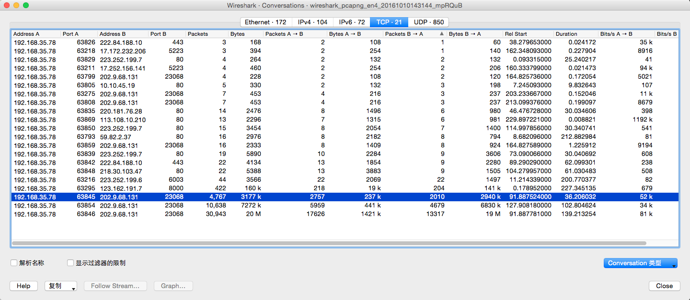

# Wireshark网络分析的艺术

# 1. 读者问

## 像福尔摩斯一样思考


点击每一个包都会显示这些属性

1. Identification 如果第一次发过来0,以后一般都是0
2. TTL默认开始是64,而中间经过了多少代理就会-1


## 来点有深度的

延迟确认发生太多会影响性能

可通过`tcp.analysis.ack_rtt > 0.2 and tcp.len ==0`来显示出有可能延迟确认带来的包


这里我自己连接小米路由器的TCP,有非常多的小米延迟连接,所以我时候也会卡之类d的

## 三次握手的小知识

客户端->SYN seq=X ->服务器

客户端<-SYN seq=Y,Ack=X+1<-服务器

客户端->Seq=X+1 ACK=Y+1->服务器


这个是我打开一个网页.然后捕抓src和dst为访问网页的IP

然后前3个就是3次握手

可以看看 Seq和ACK值的变化和我刚的描述变化是一样的

当然这个数字太长,可以默认初始值都为0

`Perferences->Protocols->TCP->勾选Relative Sequence Numbers`

这样设置后,成功的握手都是一样的,但是失败的握手就不一样了

失败握手一般分为两种情况

1. 被拒绝
2. 丢包

一般获取失败握手的表达式可以设置为

`(tcp.flags.reset==1) && (tcp.seq ==1)`

或者

过滤重传的握手请求: `(tcp.flags.syn == 1) && (tcp.analysis.retransmission)`

找到了之后,右键追踪TCP流

这是我的一个被拒绝得TCP流


但是这样没办法判断丢包是

1. 没传到服务器就丢了
2. 还是服务器接受到了,但是回传的时候丢了

所以最好在客户端和服务器同时抓包

说说DDoS

原理就是大量主机发送SYN请求给服务器,假装建立TCP,这些SYN请求可能包含假的源地址,所以服务器永远收不到Ack,就会留下half-open的连接,每个TCP占用一定的系统资源,建立多了服务器资源就会被耗光

## 被误解的TCP

TCP并非每一个数据包都有对应的Ack

因为延迟确认可以多个包对应一个Ack

TCP VS UDP

误解是

TCP效率低因为要往返确认Ack

而UDP无需确认,就效率高

但是这是区分场景的

在传送大包时,只要窗口足够大,整个通道充满着TCP,只要窗口足够大,TCP也可以不受往返的约束而源源不断的传输数据

而在传输小包时,本来一个往返就能完成的,却要耗费3次握手和4次挥手,效率的确很低

## 最经典的网络问题

Wireshark性能三把虎

1. 查看平均流量速度: Statistics->Summary
2. 查看建议: Analyze->Expert Infos
3. 查看数据传输: 选中某个包,Statistics->Tcp StreamGraph->TCP Sequence Graph(Stevents),正常的传输是一条直线,中间无中断过程

纳格(Nagle)算法: 解决小包问题

```javascript
if 有新数据要发
  if 数据量超过MMS(即一个TCP包所能携带的最大数据量)
    立即发送
  else
    if 之前发出去的数据尚未确认
      把数据缓存亲来,凑够MSS或等待确认到达再发送
    else
      立即发送
    else if
  else if
else if  
```

## 为什么丢单子

Linux用户访问挂载文件夹

用户同时在20个群组

现在分别有20个群组权限的文件夹

用户只能打开前16个,而后4个不能打开

不通过挂载,而在本地文件夹设置权限,20个都可以打开

在RFC 5532 发现了gids<16>的代码,即访问挂载点要PRC层传递gids

而本地访问文件夹是不需要的

解决方式有

1. 把客户端的/etc/passwd和/etc/group复制到服务器上,但是问题是客户端修改了群组,而忘记同步到服务器时,就会有问题

### 虚惊一场

4次挥手

```
服务器 -> FIN Seq=X Ack=Y(我想断连接) -> 客户端
服务器 <- Seq=Y,Ack=X+1(知道了,断开吧) <- 客户端
服务器 <- FIN Seq=Y,Ack=X+1 (我也想断连接) <- 客户端
服务器 -> Seq=X+1,Ack=Y+1(知道了,断开吧) -> 客户端
```

延迟确认可以把4次挥手减少到3次

## Wireshark的提示

> 1.Packet size limited during capture

一般是因为抓包引起的,tcpdump默认只抓96个字节,可以通过-s设置

> 2.TCP Previous segment not captured

后一个包的Seq号为前一个包的Seq+Len(除了三次握手和四次挥手)

如果后一个包的Seq大于前一个包的Seq+Len,证明确实了一段数据

如果整个网络包都找不到(排除错乱),就会提示TCP Previous segment not captured

丢包分两种情况

1. 真的丢了: 无对方回复的Ack
2. 抓包工具没抓到: 有对方回复的Ack

> 3.TCP ACKed unseen segment

可以忽略

> 4.TCP Out-ofOrder

TCP包乱序了

2 1 3 4 5 这样乱没事

但是

2 3 4 5 1 这样的话 会触发Dup Ack 会导致1号包重传

> 5.TCP Dup ACK

因为乱序,

当接收方收到一些Seq比期望值大的包它每接受一个这种的包就会Ack一次期望的值,以此提醒发送方,所以就产生了重复的Ack

> 6.TCP Fast Retransmission

当发送了3个/以上的TCP Dup ACK就意识到包可能丢了,于是快速重传

> 7.TCP retransmission

如果一个包真的丢了 又没有后续包可以在接触方触发Dup Ack,就不会快速重传,这种情况发送方只好等到超时再重传,就会触发Tcp Retransmission

> 8.TCP zerowindow

TCP包中包邮 `win=`表示接收窗口的大小,即表示这个包的发送方当前还有多少缓存区可以接受数据

当win=0 就会打上TCP zerowindow的标记,表示缓存区已满,不接受数据

> 9.TCP window Full

表示这个包的发送方已经把对方所声明的接收窗口耗尽了

TCP window Full: 这个包的发送方暂时没办法再发送数据了

TCP zerowindow: 这个包的发送方暂时没有办法再接受数据了

两者都以为着传输暂停,需要引起重视

> 10.TCP segment of a reassembled PDU

当你接受到这个提醒

`Edit-Preferences-Protocols-TCP菜单`中启用了Allow sub dissector to reassemble TCP streamss

表示可以把属于同一应用层的PDU的TCP包虚拟的集中起来

> 11.Continuation to

这个表示你关闭了`Edit-Preferences-Protocols-TCP菜单`中的Allow sub dissector to reassemble TCP streamss

> 12.Time-to-live-exceeded(Fragment reassembly time exceeded)

ICMP报错种类很多,但不难理解

# 工作中的Wireshark

## 书上错了吗

在服务器上因为网络延迟,包的顺序可能不会和客户端一抹一样

## 计算在途字节数

网络承载量: 已经发出去,但尚未被确认的字节数

如果超载了,就会丢包重传

在途字节数 = Seq + Len -Ack

Seq和Len书来自上一个数据发送方的包,Ack则是上一次数据接收方的包

## 估算网络拥塞点

找到拥塞点,拥塞的特征是大量重传

先从Wireshark中找到一连串重传包的第一个,再根据该重传包的Seq
值找到原始包,最后计算该原始包发送时刻的在途字节数

1. Analyze->Expert Info->Notes,得到重传列表,找到第一个retransmission(或者过滤`tcp.analysis.retransmission`)
2. 记录其Seq,笔者这次找到的是`4294960297`,过滤`tcp.seq==4294960297`,然后清楚过滤,找到该条记录的上一条来自服务器的包
3. 然后把seq+len-上次服务器的包的ack

## 顺便说说LSO

如果在上面估算网络拥堵点时,发现只见重传包,不见原始包,有可能

1. 这个包实在接收方抓的,看不到已经在路上丢失的原始包很正常
2. 开始抓包的时候,原始包已经传完了,看不到它也很正常
3. Wireshark出BUG,把一个正常的包标记为TCP Fast Retransmission

正常的网络工作方式

1. 传统: 应用层把产生的数据交给TCP,TCP层再根据MSS大小进行分段(CPU负责),然后交给网卡
2. 启用LSO: TCP层就可以把大于MSS的数据直接给网卡,让网卡负责分段工作

## 熟读RFC

懵逼

## 一个你本能解决的问题

TCP在大的数据传输时,可以重组分片

而UDP则无法重组,需要重新发,但理论上也可以重组分片,但是需要研发给力(UDP没有MSS的概念,一股脑交给网络层,所以可能被分片,分片和重组都会影响性能,所以这点UDP比TCP落后一点)

TCP中最大的分段大小称为MSS(Maximum Segment Size),它相当于把MTU刨去IP头和TCP头之后的大小,所以一个MSS恰好能装进一个MTU中

## 几个关于分片的问题

> 1.为什么要分片

把数据分隔成小包后才实现了链路共享

最开始MTU(Maximum Transmission Unit)为128,后来20世纪80年代,发展MTU为1500,一般IP头为20字节,所以数据包最大一般为1480字节

> 2.发送方要怎么确定分片大小的

一般的分片会带有off=0 off=1480 off=2960的偏移量

不过不是所有分片都是1500的

有些网络是Jumbo Frame(巨帧)或PPPOE之类的,MTU不是1500

例如巨帧MTU可能是9000,那么遇到网络设备为1500的那就可能被重新分片/丢弃,比较理想的是通过Path MTU Discovery来探测路径上最小的MTU,但是该协议依靠ICMP,会被很多设备禁用,所以不太可靠

所以发送方没有一个很好的机制确定最佳分片大小,所以实施和运维人员配置MTU需要慎之又慎,尽量使用网络的每个设备的MTU保持一致

> 3.接收方又是靠什么重组分片的

每个分片都会包含`off=xxx,ID=008c`的信息

把ID相同的分片按off进行重组

问题在于如何判断最后一个分片已经到达,应该开始重组了

最后一个包带有`More fragments=0`的Flag,用于确认最后一个分片

而其他非最后一个包则带有`More Fragments = 1`的Flag表示后面还有更多分片,所以先缓存着,不重组

有一个攻击方式就是持续发送More Gragements为1的包,导致对方一直缓存分片,而耗尽内存

> 4.TCP是如何避免被发送方分片的

TCP中最大的分段大小称为MSS(Maximum Segment Size),它相当于把MTU刨去IP头和TCP头之后的大小,所以一个MSS恰好能装进一个MTU中

UDP没有MSS的概念,一股脑交给网络层,所以可能被分片,分片和重组都会影响性能,所以这点UDP比TCP落后一点

> 5.TCP怎么适配接收方的MTU

问题4说了TCP包不会被发送方分片,但是万一接收方的MTU比发送方小怎么办

所以TCP在三次握手的前两次是声明了自己的MSS的,客户端会适配接收方的MTU的

但是假如发送方和接收方中间有一个交换机的MTU比发送方和接收方的都小,那还是会有问题的

> 6.为什么UDP比TCP更适合语音

UDP VS TCP

1. UDP: 盲目苦干,搬运过程中丢了东西也不管
2. TCP: 小心翼翼,丢了多小的东西都要回去捡

语音丢包只会影响语音质量,而不会引起延迟

## MTU导致的悲剧

当客户端发送巨帧给服务器,要么分片,要么丢弃

1. 分片: 没有携带DF(Don't fragment)标志,会影响性能
2. 丢弃: 巨帧在网络携带了DF(Don't fragment)标志,会一直丢包,重传多少次都丢包

实验

```shell
//在window下,在Mac尝试命令行不行
ping 10.32.106.102 -l 1472 -f -n 1 // 成功
ping 10.32.106.102 -l 1473 -f -n 1 //失败
```
1. -l表示携带字节
2. -f表示带DF标志

因为ICMP头为8字节 IP头20字节,所以第二个字节为1501,超过1500,所以会一直丢包

## 迎刃而解

小故事

## 昙花一现的协议

用Ethernet获取资源文字+FC读取大的文件,解决旧时代带宽小的问题

但后来带宽大了,接近FC了,这些协议就GG了

## 另一种流控

客户端-交换机(千兆)-宽带(万兆)

宽带升级万兆后更卡,因为交换机的缓存区容易满,导致丢包

接近方式

1. 引用暂停帧: 固定的MAC 01-80-操-00-00-01,暂停时间65535quanta(每个quanta相当于512比特时间)

丢包重传超过0.1%就很容易引起性能问题

## 过犹不及

TCP建立太多了,把链路占得过满,导致

1. 多个连接需要更高德资源成本
2. 太多连接抢占同一个链路,增加丢包率

## 治疗强迫症

研究Notepad Notepad Excel共同编辑服务器文件时,各软件处理冲突的抓包分析

## 技术和工龄

三次握手时双方都有一个叫Window Scale值告诉对方,对方收到这个会当作2的指数,算出的值再作为接受窗口的系数,在此后客户端接受到服务器所声明的窗口就自动乘以这个接受窗口的系数

但是在三次握手后抓的包,wireshark无法知道这个系数会提示

`window size scaling factor: -1(unknown)`

## 如何科学地推卸责任

通过wireshark分析重发的包

## 一个面试建议

总结很重要

# 生活中的Wireshark

## 假带宽的真相

Wireshark->Statistics菜单->Conversations,可以得到当前的会话




## 手机抓包

## 我的微博为什么会卡

抓包发现每次连接依赖DNS查询,解决方案为缓存DNS

##寻找HttpDNS

http://www.ipip.net/ 查询IP

被骗的作者,实验失败,并没有找到

原理是通过自己的服务器找DNS

##谁动了我的网络

ip.src == ip 或者 id.addr 过滤

服务器每发一个包,Identification就会加一

## 一个协议的进化

准备迎接HTTP2.0吧

## 假装产品经理

把IP变成域名

`View->Name Resolution-> Enable for Network layer`

可以通过wireshark分析网络交互

##自学窍门


